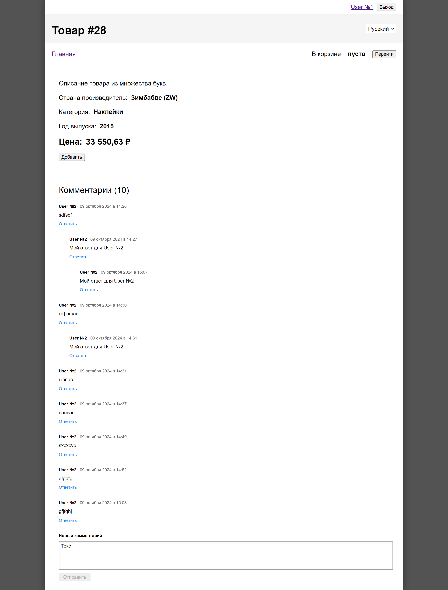

# Логика приложения

[Ссылка на Макет в Figma](https://www.figma.com/file/zlt4bp3VfyaSUTf1qbMLn0/YLAB-webinar---TASK5?type=design&node-id=0%3A1&t=QzhP1Ra2i0XTkiRB-1)

## Задача

На странице товара добавить пользовательские комментарии.

Комментарии отображаются сразу все в виде иерархии. В каждом комментарии имя автора, дата, текст и ссылка для ответа на комментарий.

Ответить или написать новый комментарий может только авторизованный пользователь. Для неавторизованного вывести текст “Войдите, чтобы иметь возможность комментировать”.

Форма для написания нового комментария показывается в самом низу под всеми комментариями. А форма ответа на комментарий под соответствующем комментарием, но после существующих веток ответов. Одновременно отображается только одна форма.

Комментарии выбираются из АПИ, в поле parent указывается id товара, который комментируется, чьи комментарии хотим выбрать.

Для создания нового комментария в parent указывается id товара. Но если создаётся ответ на другой комментарий, то в parent указывается идентификатор комментария, на который отвечаем.

В качестве внешнего состояния для комментариев применить redux. (классический, подготовленный в коде). Всё переписывать на redux не надо.

Swagger: <http://query.rest/api/v1/docs/>

Используйте АПИ адрес <http://query.rest/api/v1> вместо оговоренного в лекции.



Функционал:

* Добавление товара в корзину, удаление;
* Подсчет стоимости и количества товаров;
* Просмотр информации о товаре на отдельной странице;
* Авторизация пользователя;
* Фильтр товаров по категориям;
* Добавление комментариев о товаре.

Технологии:

* React JS;
* Redux;
* Webpack;
* API.

## Инструкция по установке

Клонировать репозиторий:

`
git clone https://github.com/Yaroslav-Chertov/react-webinar-5.git
`

В директории проекта запустить приложение в режиме разработки:

```
npm install
npm start
```
